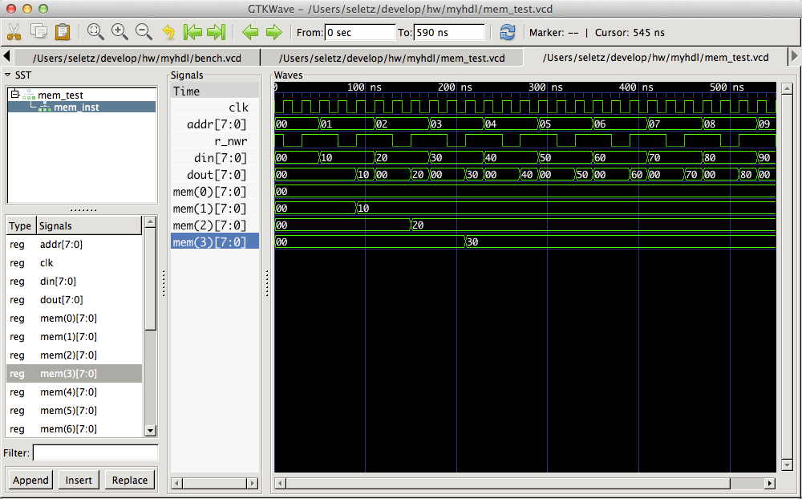

# myhdl-testing
This repo is for testing myhdl in CI or other automation.
The original code is from https://github.com/seletz/myhdl-test.git

Little changes so far, except porting to Python 3.

Below the origina README ( https://github.com/seletz/myhdl-test.git )

myhdl-test
==========

Repository to test [MyHDL](http://www.myhdl.org)

Setup
-----

Make a virtualenv and install the requirements::

    $ mkvirtualenv myhdl
    $ git clone ...
    $ cd $CLONED_DIR
    $ setvirtualenvproject
    $ pip install requirements.txt
    
This will install some MyHDL and some other packages I wind useful
for development.

To view the waveforms generated by the tests, you want to fetch
[gtkwave](http://gtkwave.sourceforge.net/)

Yes, and what the hell?
-----------------------

Ok, here's a test of a minimal hardware memory example,
and the Verilog code MyHDL generates::

    $ cd $REPODIR
    $ make clean
    $ make tests hdl
    ... some output
    $ open mem_test.vcd  # or gtkwave mem_test.vcd if you're on Linux
    


Verilog code of a 16bit x 16 memory:

```verilog
// File: mem.v
// Generated by MyHDL 0.8
// Date: Fri Apr 18 16:07:52 2014


`timescale 1ns/10ps

module mem (
    dout,
    din,
    addr,
    r_nwr,
    clk
);
// memory

output [15:0] dout;
wire [15:0] dout;
input [15:0] din;
input [15:0] addr;
input r_nwr;
input clk;


reg [15:0] mem [0:16-1];


always @(posedge clk) begin: MEM_WRITE
    if ((r_nwr == 0)) begin
        mem[addr] <= din;
    end
end


assign dout = mem[addr];

endmodule
```
